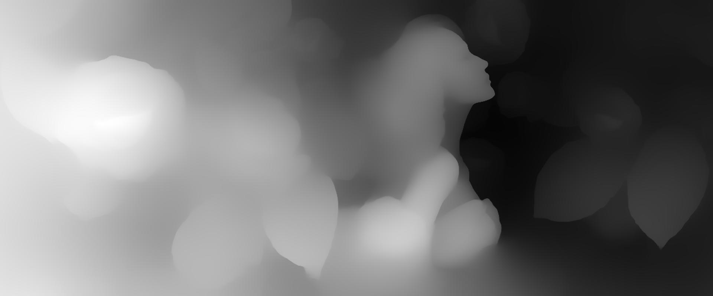
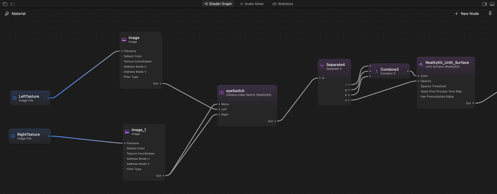

Can an ordinary photograph feel three-dimensional on Vision Pro? And if the input is a frame from a video player, can the same approach work during playback?

These questions led to my StereoImaging experiment. The basic pipeline is straightforward: **estimate the relative depth of an image, use it to synthesize two slightly different views, and display one view to each eye.**

This article revisits my experiment notes from April 2025. I will start with a still image, then discuss what changes when the input becomes a stream of video frames. Here, “real-time” describes the intended application. The original notes do not include a reproducible frame-rate or latency benchmark.

## Why two views create depth

Our eyes observe a scene from slightly different positions. The resulting difference between their images—binocular disparity—is one of the cues the visual system uses to judge depth.

Moving your viewpoint offers a useful intuition: nearby objects usually shift more in the image than distant ones. In an ideal parallel stereo camera model, disparity increases with focal length and the distance between the cameras, and decreases with distance to the subject.


With an existing 2D image, we do not have the second camera's view. Instead, we estimate depth and use that estimate to synthesize a change in viewpoint. This can produce stereo depth cues, but it does not recover a complete 3D scene that can be viewed from arbitrary positions.

## Start with an image and a depth map

Here is the source image used in the experiment.


The next step is monocular depth estimation. [Depth Anything V2](https://depth-anything-v2.github.io/) is one option: its standard models estimate relative depth, while separately fine-tuned models address metric depth. For Apple platforms, Apple's [Core ML model catalog](https://developer.apple.com/machine-learning/models/) provides models that can be integrated into an app.



This visualization uses **white for near regions and black for distant regions**. To keep that convention distinct from physical distance, let `d` represent a normalized _nearness_ value:

- A value closer to `1` means closer to the viewer.
- A value closer to `0` means farther into the background.
- The range `0–255` describes the displayed grayscale encoding. Dividing it by `255` gives a normalized value, not a distance in meters.

The interpretation matters. Before connecting a model to a renderer, verify what its output represents, which direction corresponds to “near,” and how it has been normalized. A variable named `depth` does not establish those details.

## Turn depth into stereo disparity

Once we have a depth ordering, we can give foreground regions a larger shift and background regions a smaller one.

A simple illustrative mapping looks like this. Image coordinates increase to the right; `d0` is the reference depth we want to place on the display plane; and `k` controls disparity strength:

```text
disparity = k × (d - d0)
x_left    = x + disparity / 2
x_right   = x - disparity / 2
```

At `d = d0`, there is no horizontal separation between the two views. Nearer and farther regions fall on opposite sides of that reference plane. Here, `k` is measured in pixels, so its value must be considered alongside the output resolution.

This is a conceptual reprojection formula, not a complete calibrated rendering algorithm. An implementation also needs to decide how to sample pixels, which surface wins when multiple pixels map to the same position, and what to do when no source pixel covers a destination.

The experiment produced the following pair. First, the left-eye view:


And the right-eye view:


The images look similar, but local positions differ. Depth controls the distribution of those differences. The stereo effect appears when each eye receives its corresponding view.

More disparity is not automatically better. Larger shifts can strengthen depth, but they also make missing background, stretched edges, and viewing discomfort more apparent. Start with a modest disparity and evaluate the result on the target display.

## Display the right image to each eye

The two images must be presented through a stereo-capable rendering path. Placing them next to each other in an ordinary window does not automatically make the content stereoscopic, and swapping the left and right views reverses the intended disparity.

On visionOS, a shader graph can use the `Camera Index Switch` node to select a different texture for each eye. Its `Left` and `Right` inputs serve stereoscopic rendering, while `Mono` supplies the single-view result. Apple's [stereoscopic image sample](https://developer.apple.com/documentation/visionOS/displaying-a-stereoscopic-image-in-visionos) demonstrates this setup.

In the graph shown in the experiment notes, `LeftTexture` and `RightTexture` feed the eye-selection node, and its output supplies the color and opacity of an unlit surface.



For readers using a 2D screen, the original experiment included a GIF that alternates between the left and right images. The animation below preserves that demonstration.

<figure>
  
  <figcaption>Alternating stereo views make their differences visible on a 2D screen. This is not a benchmark of video conversion or a substitute for binocular viewing in a headset.</figcaption>
</figure>

The animation can resemble a rocking viewpoint, but it does not contain head tracking. It also does not demonstrate the ability to reveal new parts of the scene as the viewer moves.

## From a still image to live video

The image pipeline can be applied to frames from a video player:

```text
Decode a video frame
        ↓
Estimate its depth
        ↓
Synthesize left and right views
        ↓
Present the stereo frame in sync with playback
```

Conceptually, this repeats the still-image process. In practice, it introduces deadlines and temporal consistency. Whether conversion can keep up with playback depends on decoding, inference, reprojection, data transfers, and presentation together—not just the time spent inside the model.

When developing this into a playback pipeline, I would focus on four areas:

1. **Bound the queue.** If processing falls behind, accumulating frames increases latency. Limit the amount of work in flight and use the playback clock to decide which frames are still useful.
2. **Measure data movement.** Converting between decoded frames, model inputs, depth outputs, and rendering textures can add substantial overhead. Measure the complete path.
3. **Balance depth resolution and edge quality.** A smaller inference input may reduce computation, but upscaling the resulting depth map can weaken alignment around silhouettes and fine details.
4. **Stabilize depth over time.** A plausible depth map in each frame does not guarantee stable depth during playback. Depth Anything V2 is an image-based method; temporal filtering or a video-specific model needs separate consideration. [Project documentation](https://depth-anything-v2.github.io/)

These are engineering directions for extending the experiment, rather than optimizations already established by its results. A useful performance report would record the device, input resolution, model configuration, end-to-end latency, and behavior during sustained playback.

## Where the illusion breaks down

**The source image does not contain the background hidden behind a subject.** Shifting a foreground object can expose a region for which there are no known pixels. Basic reprojection leaves holes; simple filling can produce smearing or stretching. Those regions need an explicit reconstruction or filling strategy.

**Estimated depth can be wrong.** Hair, transparent objects, reflections, and complex boundaries deserve close inspection. A small error in a depth map can become a visible disagreement between the two eyes after reprojection.

**Video needs a stable depth scale.** Independently normalizing each frame can make an object's disparity change as the composition changes. Smoothing may reduce flicker, but it can add lag or leave artifacts during motion. Scene cuts need their own handling.

The result therefore depends on more than the appearance of the depth map. Reprojection, occlusion handling, temporal stability, and the target display all affect the experience.

## Where this approach could be useful

One application is imagery in spatial interfaces: existing covers, posters, and promotional images can gain a modest sense of depth without preparing a separate stereo pair by hand. Another is a player that synthesizes stereo views from ordinary video during playback.

Keeping these stages separate—the original image, its depth map, the two synthesized views, and the final display—makes each result easier to inspect. It also helps identify whether the next improvement belongs in depth estimation, image quality, or processing latency.

## References

- [Apple: Core ML Models](https://developer.apple.com/machine-learning/models/)
- [Apple: Displaying a stereoscopic image in visionOS](https://developer.apple.com/documentation/visionOS/displaying-a-stereoscopic-image-in-visionos)
- [Apple: Depth Anything V2 Small for Core ML](https://huggingface.co/apple/coreml-depth-anything-v2-small)
- [Depth Anything V2: project page and video notes](https://depth-anything-v2.github.io/)
- [Depth Anything V2: source and model documentation](https://github.com/DepthAnything/Depth-Anything-V2)
- [Depth Anything V2 paper](https://arxiv.org/abs/2406.09414)
