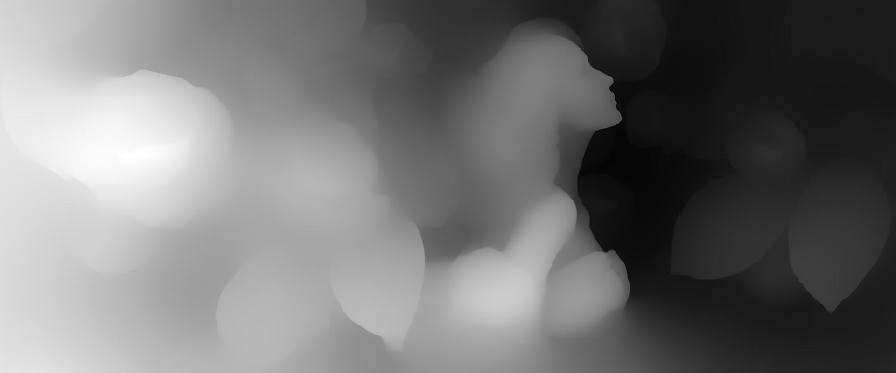
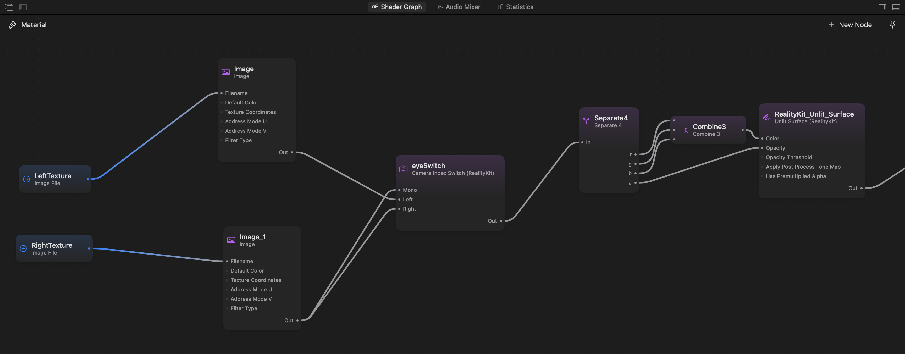

一张普通照片能否在 Vision Pro 中呈现出立体感？如果输入变成视频播放器中的画面，这套方法又能否在播放过程中实时运行？

这些问题促成了我的 StereoImaging 实验。它的基本流程很直接：**估算图像的相对深度，据此合成两个略有差异的视图，再分别向左右眼显示对应的视图。**

本文重新整理了我在 2025 年 4 月记录的实验笔记。我会先从一张静态图像开始，再讨论当输入变成连续的视频帧时会发生哪些变化。这里的“实时”描述的是预期应用方式；原始笔记并未提供可复现的帧率或延迟基准。

## 为什么两个视图能产生深度感

双眼从略有不同的位置观察同一场景，由此产生的图像差异——双目视差——是视觉系统判断深度的重要线索之一。

移动观察位置可以帮助我们建立直觉：图像中的近处物体通常比远处物体移动得更多。在理想的平行双目相机模型中，视差会随焦距和相机间距增大，并随物体距离增大而减小。


面对一张现有的 2D 图像，我们没有第二台相机拍摄的视图。因此，需要先估算深度，再利用这份估算结果合成视点变化。这可以产生立体深度线索，但无法恢复一个能够从任意位置观察的完整 3D 场景。

## 从图像和深度图开始

下面是实验使用的原始图像。


下一步是单目深度估计。[Depth Anything V2](https://depth-anything-v2.github.io/) 是一种选择：它的标准模型估算相对深度，另有单独微调的模型用于度量深度。在 Apple 平台上，可以从 Apple 的 [Core ML 模型目录](https://developer.apple.com/machine-learning/models/)中选择并集成适合的模型。



这张可视化图使用**白色表示较近区域，黑色表示较远区域**。为避免把这一约定与物理距离混淆，下文用 `d` 表示归一化的_接近度_：

- 越接近 `1`，表示越靠近观察者。
- 越接近 `0`，表示越深入背景。
- `0–255` 是显示用灰度编码范围。除以 `255` 后得到的是归一化数值，而不是以米为单位的距离。

正确理解模型输出非常重要。把模型接入渲染器之前，应先确认输出代表什么、哪个方向对应“近”，以及它采用了怎样的归一化方式。变量名叫作 `depth` 并不能说明这些细节。

## 把深度转换为立体视差

得到深度顺序后，可以让前景区域产生较大的位移，让背景区域产生较小的位移。

下面是一种用于说明概念的简单映射。图像坐标向右递增，`d0` 是希望放在显示平面上的参考深度，`k` 用来控制视差强度：

```text
disparity = k × (d - d0)
x_left    = x + disparity / 2
x_right   = x - disparity / 2
```

当 `d = d0` 时，左右视图之间没有水平偏移。更近和更远的区域会落在参考平面的两侧。这里的 `k` 以像素为单位，因此必须结合输出分辨率来选择它的值。

这只是用于解释概念的重投影公式，并不是一套完整、经过标定的渲染算法。实际实现还必须决定如何采样像素、多个像素映射到同一位置时哪个表面优先，以及目标位置没有任何源像素覆盖时如何处理。

实验生成了下面这对图像。首先是左眼视图：


然后是右眼视图：


两张图看起来很相似，但局部位置有所不同，深度决定了这些差异如何分布。当每只眼睛分别看到对应视图时，立体效果就会出现。

视差并不是越大越好。更大的位移虽然能增强深度感，也会让缺失背景、边缘拉伸和观看不适更加明显。应从较小的视差开始，并在目标显示设备上评估结果。

## 向每只眼睛显示正确的图像

这两张图必须通过支持立体显示的渲染路径呈现。把它们并排放进普通窗口并不会自动让内容变成立体；如果交换左右眼视图，还会反转原本的视差关系。

在 visionOS 上，着色器图可以使用 `Camera Index Switch` 节点为每只眼睛选择不同的纹理。它的 `Left` 和 `Right` 输入用于立体渲染，`Mono` 则提供单视图结果。Apple 的[在 visionOS 中显示立体图像示例](https://developer.apple.com/documentation/visionOS/displaying-a-stereoscopic-image-in-visionos)演示了这种配置。

在实验笔记所示的图中，`LeftTexture` 和 `RightTexture` 接入眼睛选择节点，节点输出再为无光照表面提供颜色和不透明度。



为了让使用 2D 屏幕的读者也能看出差异，原始实验加入了一张在左右眼图像之间交替的 GIF。下面的动画保留了这个演示。

<figure>
  
  <figcaption>交替显示立体视图，可以在 2D 屏幕上看出它们的差异。这既不是视频转换性能基准，也不能替代头显中的双目观看体验。</figcaption>
</figure>

动画看起来可能像观察位置在左右摇摆，但它并不包含头部追踪，也无法证明观察者移动时能够看到场景中新显露的区域。

## 从静态图像扩展到实时视频

可以把这套图像流程应用到视频播放器输出的每一帧：

```text
解码视频帧
    ↓
估算深度
    ↓
合成左右眼视图
    ↓
与播放进度同步呈现立体帧
```

从概念上说，这只是不断重复静态图像的处理过程。但在实践中，它引入了时限和时间一致性问题。转换能否跟上播放，取决于解码、推理、重投影、数据传输和呈现的整体开销，而不仅是模型内部花费的时间。

如果把这个实验继续发展成播放流程，我会重点关注四个方面：

1. **限制队列长度。** 当处理速度落后时，持续积压视频帧只会增加延迟。应限制同时进行的任务数量，并根据播放时钟判断哪些帧仍有处理价值。
2. **测量数据传输。** 在解码帧、模型输入、深度输出和渲染纹理之间转换，可能引入显著开销。需要测量完整链路。
3. **平衡深度分辨率与边缘质量。** 减小推理输入尺寸可以降低计算量，但放大输出的深度图可能削弱轮廓和细节处的对齐精度。
4. **稳定时间维度上的深度。** 每一帧看似合理的深度图，并不意味着播放时的深度稳定。Depth Anything V2 是面向图像的方法；时间滤波或视频专用模型需要另行考虑。[项目文档](https://depth-anything-v2.github.io/)

这些是扩展实验时值得探索的工程方向，并非已经由实验结果验证的优化方案。一份有参考价值的性能报告，应记录设备、输入分辨率、模型配置、端到端延迟，以及持续播放时的表现。

## 立体错觉会在哪里失效

**原始图像并不包含被主体遮挡的背景。** 移动前景物体时，可能暴露出没有已知像素的区域。基础重投影会留下空洞，简单填充又可能造成涂抹或拉伸。这些区域需要明确的重建或补全策略。

**估算的深度可能出错。** 头发、透明物体、反射和复杂边界都值得仔细检查。深度图中的微小误差经过重投影后，可能变成左右眼之间明显的不一致。

**视频需要稳定的深度尺度。** 如果每一帧都独立归一化，物体的视差可能随着画面构图变化。平滑处理可以减少闪烁，却也可能增加滞后，或在运动时留下伪影；场景切换还需要单独处理。

因此，最终效果不只取决于深度图看起来如何。重投影、遮挡处理、时间稳定性和目标显示设备都会影响观看体验。

## 这套方法可能用于哪里

一种用途是空间界面中的图像：无需手工准备另一张立体图，就能让现有封面、海报和宣传图获得适度的深度感。另一种用途，则是在播放过程中为普通视频合成立体视图的播放器。

把原始图像、深度图、两个合成视图和最终显示这些阶段彼此分开，可以更容易检查每一步的结果，也有助于判断下一项改进应落在深度估计、图像质量还是处理延迟上。

## 参考资料

- [Apple：Core ML 模型](https://developer.apple.com/machine-learning/models/)
- [Apple：在 visionOS 中显示立体图像](https://developer.apple.com/documentation/visionOS/displaying-a-stereoscopic-image-in-visionos)
- [Apple：适用于 Core ML 的 Depth Anything V2 Small](https://huggingface.co/apple/coreml-depth-anything-v2-small)
- [Depth Anything V2：项目主页和视频说明](https://depth-anything-v2.github.io/)
- [Depth Anything V2：源代码和模型文档](https://github.com/DepthAnything/Depth-Anything-V2)
- [Depth Anything V2 论文](https://arxiv.org/abs/2406.09414)
